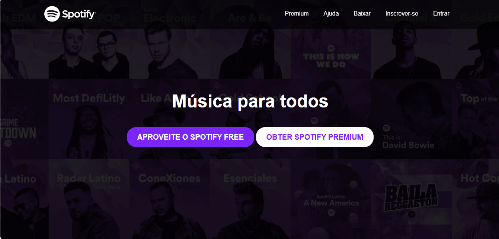

# 🎧 Landing Page - Spotify Clone

Este repositório contém uma landing page responsiva inspirada no Spotify, desenvolvida com **HTML**, **CSS** e **Bootstrap**. O projeto tem como objetivo praticar a construção de layouts modernos, com foco em design responsivo, customização visual e estruturação de componentes de interface.

---

## 📸 Preview



---

## 🚀 Tecnologias Utilizadas

- HTML5
- CSS3
- Bootstrap 4.1
- Font Awesome

---

## 📱 Responsividade

O layout foi construído utilizando o sistema de grid do Bootstrap e media queries customizadas, garantindo boa visualização em diferentes tamanhos de tela (mobile, tablet e desktop).

---

## 🎨 Funcionalidades

- Cabeçalho fixo e transparente
- Seção principal com chamada para ação (CTA)
- Seção com descrição de serviços e recursos
- Imagens decorativas com rotação e hover
- Botões personalizados com efeitos de transição

---

## 📂 Estrutura de Pastas
```
📁 projeto-spotify/
├── 📁 imagens/
│   ├── spotify.svg
│   ├── capa.png
│   ├── img1.jpg
│   └── ...
├── 📁 estilos/
│   └── style.css
├── index.html
└── README.md
```


---

## 💡 Como Executar

1. Clone o repositório:
```bash
git clone https://github.com/eduardar0/projeto-Spotfy.git

``` 

2. Abra o arquivo index.html no seu navegador.